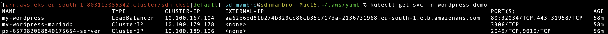

INSTALLAZIONE di Wordpress tramite HELM Chart
=============================================

Puoi ottenere l’ID dell’account AWS (AWS Account ID)

```coffee
aws sts get-caller-identity --query Account --output text
```

Comando per loggarsi a helm registry su EKS (validità 12 ore)

aws ecr get-login-password \\

 --region eu-south-1 | helm registry login \\

 --username AWS \\

 --password-stdin 803113055342.dkr.ecr.eu-south-1.amazonaws.com

Comando per installare wordpress attraverso helm:

Creazione del namespace per wordpress (definito anche nello yaml di wordpress di bitnami)

```coffee
kubectl create namespace wordpress-demo
```

Comando per creare la storage class per i frontend di wordpress (storage class è anche definita nello yaml di wordpress di bitnami)

```coffee
kubectl apply -f sc_px_sharedv4.yaml
```

Comando per installare wordpress:

```coffee
helm install my-wordpress oci://registry-1.docker.io/bitnamicharts/wordpress -n wordpress-demo -f bn-wordpress-values.yaml
```

Verifica del pod wordpress-demo

```coffee
 kubectl get po -n wordpress-demo
```

Verifica del servizio wordpress (verificare se mappato su external-ip)

```coffee
kubectl get svc -n wordpress-demo
```



Eventualmente verificare con il comando --watch my-wordpress se viene assegnato l’indirizzo estero tramine load balancer.

Verificare il bound dei pvc mappati a my-wordpress

```coffee
kubectl get pvc -n wordpress-demo
```

Verificare se lato Portworx i volumi sono in uso:

pxctl volume list


Per avere le informazioni del cluster eks:

```coffee
aws eks describe-cluster --name sdm-eks1 --region eu-south-1
```

Avviare le EC2 in stato stopped dopo px-deploy. Elencare le istanze in qualsiasi status.

```coffee
aws ec2 describe-instances \
    --region eu-central-1 \
    --filters "Name=tag:px-deploy_name,Values=sdm-px" \
    "Name=instance-state-name,Values=*" \      
    --query "Reservations[*].Instances[*].InstanceId" \
    --output text
```

Filtrarle per status "stopped"

```coffee
aws ec2 describe-instances \
    --region eu-central-1 \
    --filters "Name=tag:px-deploy_name,Values=sdm-px" \
    "Name=instance-state-name,Values=stopped" \      
    --query "Reservations[*].Instances[*].InstanceId" \
    --output text
```

segnarsi gli ids restituiti, ed avviare le ec2.

```coffee

aws ec2 start-instances \
    --region eu-central-1 \
    --instance-ids i-0c2dd4b3dbc5feffe i-0e0f3c3a1bf1c73ec i-0533af57be6492acf i-04e6c1aaac577cb44
```

