Una volta terminata la creazione cluster EKS AWS, andare sul sito Porworx Central per la generazione dello yaml necessario per installare il cluster PX.

Attraverso il wizard: 

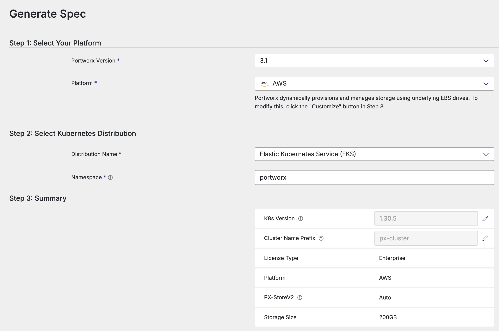

cliccare su CUSTOMIZE:

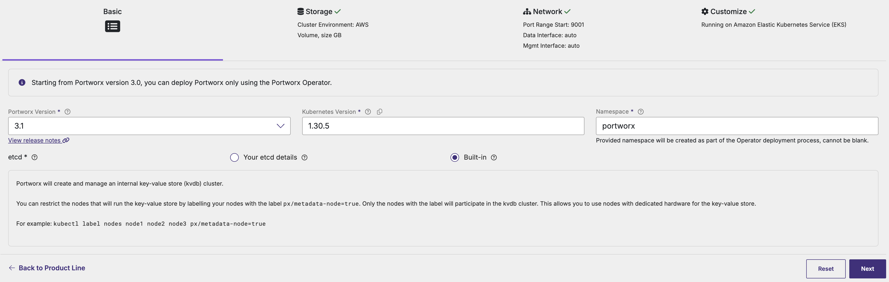

cliccare NEXT: 

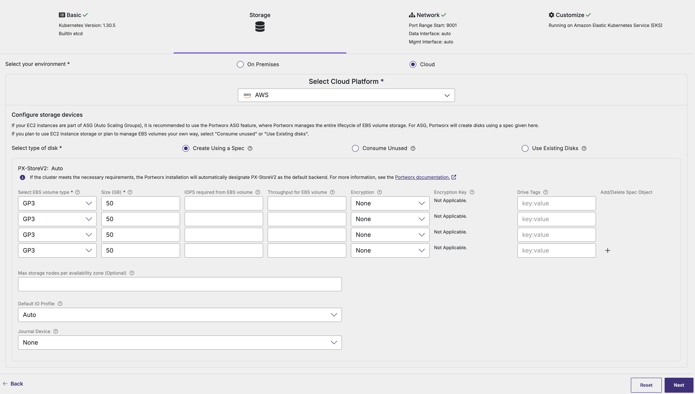

lasciare tutto in defaults (anche i drive GP3 proposti). cliccare NEXT:

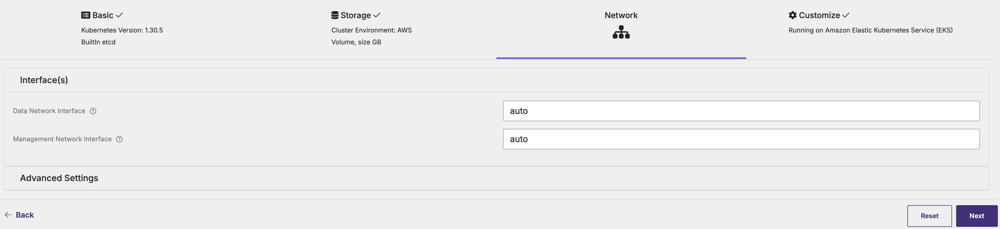

cliccare NEXT:

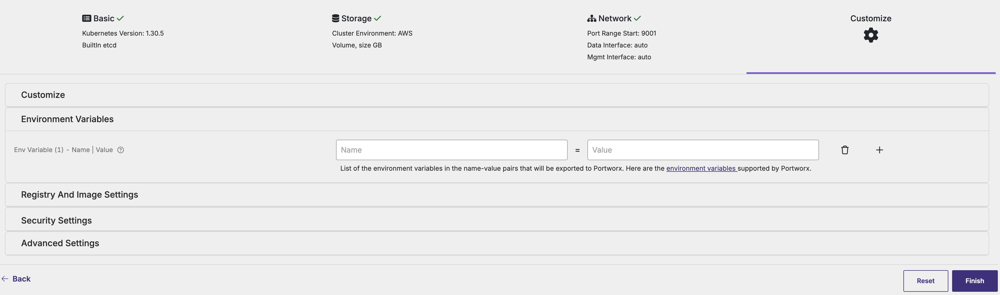

Infine cliccare su FINISH

scaricare il file YAML cliccando sul Download .yaml

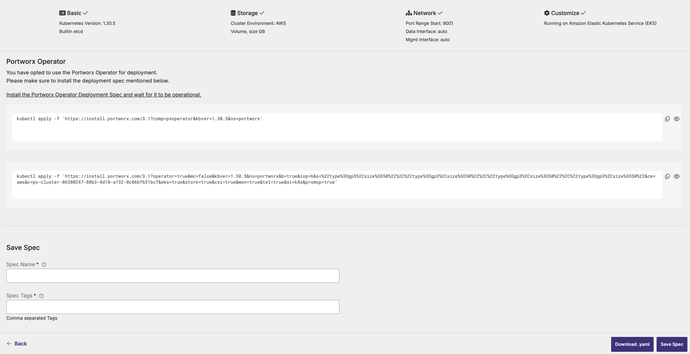

Procedere su EKS con la creazione del namespace “portworx”:

```coffee
kubectl create namespace portworx
```

Installare l’operator Portworx

```coffee
kubectl apply -f 'https://install.portworx.com/3.1?comp=pxoperator&kbver=1.30.5&ns=portworx'
```

[](https://install.portworx.com/3.1?comp=pxoperator&kbver=1.30.5&ns=portworx)editare il file .yaml scaricato e modificare la quantità di dischi GP3 richiesti (da 4 a 1), vedi esempio:

\# SOURCE: https://install.portworx.com/?operator=true&mc=false&kbver=1.30.5&ns=portworx&b=true&iop=6&s=%22type%3Dgp3%2Csize%3D50%22%2C%22type%3Dgp3%2Csize%3D50%22%2C%22type%3Dgp3%2Csize%3D50%22%2C%22type%3Dgp3%2Csize%3D50%22&ce=aws&c=px-cluster-26393b94-045c-4e7f-8338-866669c653e6&eks=true&stork=true&csi=true&mon=true&tel=true&st=k8s&promop=true

kind: StorageCluster

apiVersion: core.libopenstorage.org/v1

metadata:

 name: px-cluster-26393b94-045c-4e7f-8338-866669c653e6

 namespace: portworx

 annotations:

 portworx.io/install-source: "https://install.portworx.com/?operator=true&mc=false&kbver=1.30.5&ns=portworx&b=true&iop=6&s=%22type%3Dgp3%2Csize%3D50%22%2C%22type%3Dgp3%2Csize%3D50%22%2C%22type%3Dgp3%2Csize%3D50%22%2C%22type%3Dgp3%2Csize%3D50%22&ce=aws&c=px-cluster-26393b94-045c-4e7f-8338-866669c653e6&eks=true&stork=true&csi=true&mon=true&tel=true&st=k8s&promop=true"

 portworx.io/is-eks: "true"

spec:

 image: portworx/oci-monitor:3.1.6

 imagePullPolicy: Always

 kvdb:

 internal: true

 cloudStorage:

** deviceSpecs:**

** - type=gp3,size=50**

 secretsProvider: k8s

 stork:

 enabled: true

 args:

 webhook-controller: "true"

 autopilot:

 enabled: true

 runtimeOptions:

 default-io-profile: "6"

 csi:

 enabled: true

 monitoring:

 telemetry:

 enabled: true

 prometheus:

 enabled: true

 exportMetrics: true

 env:

Andare sulla console AWS e collegare la IAM Policy "EC2-Portworx-Clouddrive” al NodeInstanceRole creato durante la creazione con eksctl. 

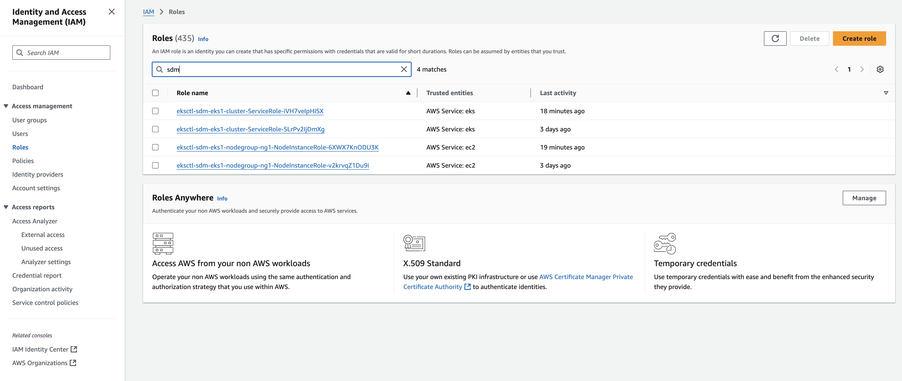

cliccare su Add Permissions ed aggiungere la policy “EC2-Portworx-Clouddrive”:

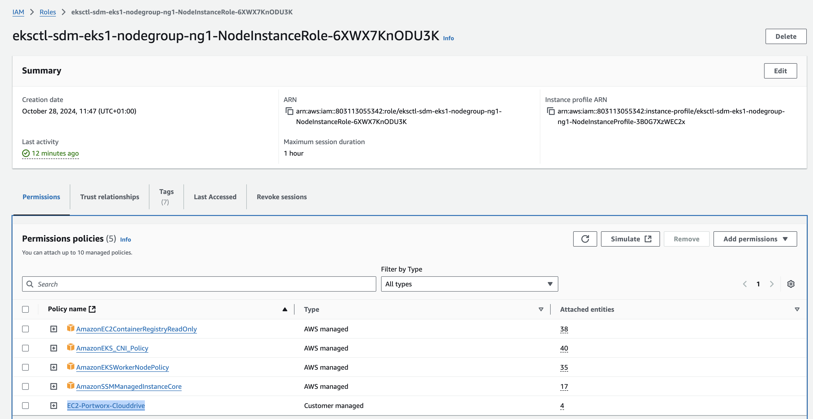

creare lo storage cluster PX:

```coffee
kubectl apply -f nomefile.yaml
```

Attendere l’aggiunta del disco GP3 da 50GB (e quello da 32GB per KVDB) alle istanze EC2 create con EKS. Verificare dalla console AWS se vengono creati i dischi: 

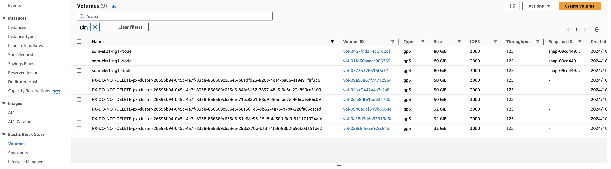

Verificare lo status di installazione di PX:

```coffee
kubectl get all -n portworx 
kubectl -n portworx get storagenodes -l name=portworx
```

Verificare se i nodi siano online: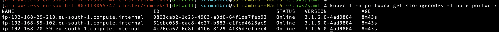

editare la configurazione dello storage cluster:

```coffee
kubectl get storagecluster -n portworx
```

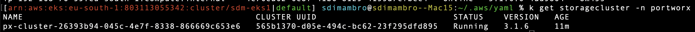

```coffee
kubectl edit storagecluster "nome dello storage cluster" -n portworx 
```

Aggiungere al file di configurazione le seguenti righe sotto "spec” : 

 deleteStrategy:

 type: UninstallAndWipe 

salvare ed uscire (:wq!)

Verificare se tutti i pods sono in esecuzione:

```coffee
kubectl get pods -n portworx -o wide | grep -e portworx -e px
```